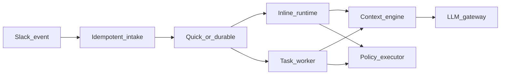

# Architecture diagnosis (Tango fork)

## Verdict

**Tango does not run OpenClaw or Hermes under the hood.**

This codebase is a fork of [Anil-matcha/open-claude-tag](https://github.com/Anil-matcha/open-claude-tag) (`tagopen`), maintained at [mwauragitonga/tango](https://github.com/mwauragitonga/tango). It is a **standalone** Slack bot (Socket Mode on Contabo; HTTP Events + OAuth scaffold for SaaS). Upstream *compares itself to* and *borrows patterns from* OpenClaw, Hermes Agent, and Letta — those are **inspiration / references**, not embedded runtimes.

On hosts that also run OpenClaw or Hermes (e.g. contabo-prod), Tango is a **separate process** (`open-claude-tag.service`). It may reuse the same Ollama Cloud API key via env vars; it does **not** share OpenClaw gateway state, Hermes `~/.hermes`, WhatsApp bridges, or messaging tokens.

Pattern map: [BORROWED-PATTERNS.md](./BORROWED-PATTERNS.md). Honesty table: [COWORKER-RUNTIME-STATUS.md](./COWORKER-RUNTIME-STATUS.md).

## Stack

| Layer | Implementation | OpenClaw / Hermes? |
|-------|----------------|--------------------|
| Slack I/O | Bolt async — Socket Mode (Contabo) or HTTP Events scaffold | No |
| LLM | LiteLLM SDK via `llm/gateway.py`; Proxy deploy scaffold for SaaS | No |
| Agent | Inline Q&A (`agent/runtime.py`) **or** durable worker (`tasks/worker.py`) | No |
| Persona | `data/org/ORG.md` + `SOUL.md`; channel `PERSONALITY.md` overlay | Hermes SOUL pattern |
| Memory | SQLite + FTS5 + bounded `MEMORY.md` + optional Mem0 hook | Not Hermes mem0-pg |
| Skills | Progressive index + `skills_list` / `skill_view` + lifecycle helpers | Hermes progressive disclosure |
| Models | Env → channel `tools.toml` → thread override; turn-local fallbacks if enabled | Hermes `/model` + failover notice |
| Tools | Policy executor + builtins + pooled MCP (`tools.toml`) | Optional Contabo Hermes bridge — [HERMES-MCP.md](./HERMES-MCP.md) |
| Search | `ddgs` by default; optional Tavily/Brave/Serper/Firecrawl | No |
| Ambient | APScheduler enqueue-only + SQLite `schedules` | Not Hermes crons |
| Orchestration | SQLite leases/checkpoints; Temporal adapter **unwired** | See [ADR-0001](./ADR-0001-sqlite-vs-temporal.md) |

## Request path (current)

```
Slack event (Socket Mode or HTTP)
  → idempotent intake (workspace + event key)
  → strip bot mention
  → classify:
        quick Q&A  → agent/runtime.py (bounded tool rounds)
        durable    → tasks store + lease + tasks/worker.py
  → context/engine.py (thread-scoped history, optional compaction)
  → llm/gateway.py (attribution metadata → llm_usage)
  → tools/executor.py (policy, HITL approve|deny, MCP pool, task_* / schedule_*)
  → checkpoint + Slack progress / final reply
```

Thread commands (with `@Tango` or as documented): `status`, `pause`, `resume`, `cancel`; HITL `approve <id>` / `deny <id>`.



## LiteLLM

- **Contabo / single-tenant:** in-process SDK (current).
- **Multi-tenant SaaS:** [LITELLM-PROXY.md](./LITELLM-PROXY.md) + `deploy/litellm-proxy/` (not Contabo production yet).

## SaaS direction

See [SAAS-ROADMAP.md](./SAAS-ROADMAP.md) and [SLACK-SAAS-MANIFEST.md](./SLACK-SAAS-MANIFEST.md). Tenants must never depend on Contabo Hermes/OpenClaw.
